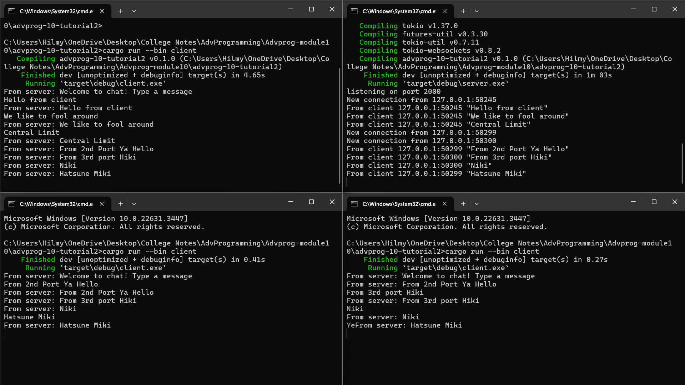
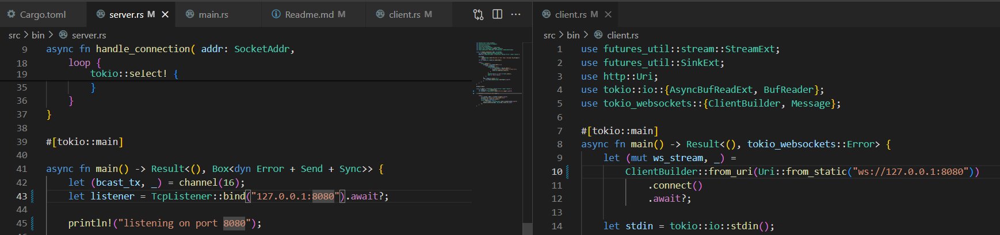
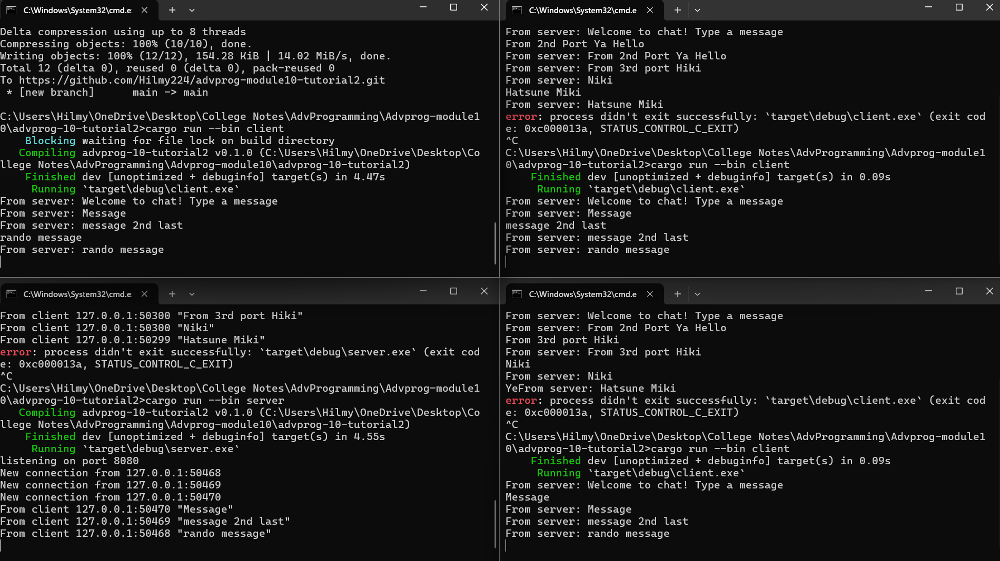

## Experiment 2.1: Original code, and how it run

How to run it
+ First run  the server by running `cargo run --bin server` now its active and listening on port 2000
+ And then run `cargo run --bin client` in 3 other terminals and  the server terminal establishes a unique port for each client, all using the same localhost but different port numbers.
+ Those ports being signaled in the servers in the example: `New connection from 127.0.0.1:50245` , `New connection from 127.0.0.1:50299`, `New connection from 127.0.0.1:50300`
+ Afterwards clients from diffrent ports are able to send messages to the server, and when they do, these messages appear both in the server terminal and in the terminals of other clients. 
+ Each message notification in the terminal specifies whcih port of the client from which the message originated.

## Experiment 2.2: Modifying port
+ Changing ports from `2000` to `8080`:

+ Running Modified server.rs and client.rs:

+ We can conclude that modifying the ports does not change how the application works. This is because both the server and client utilize the WebSocket protocol provided by tokio_websockets for communication between them.